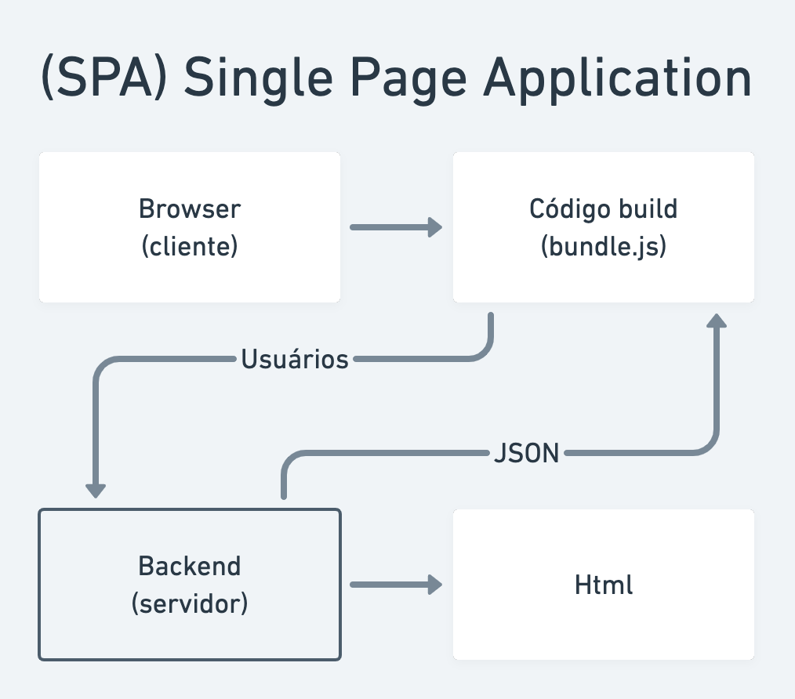
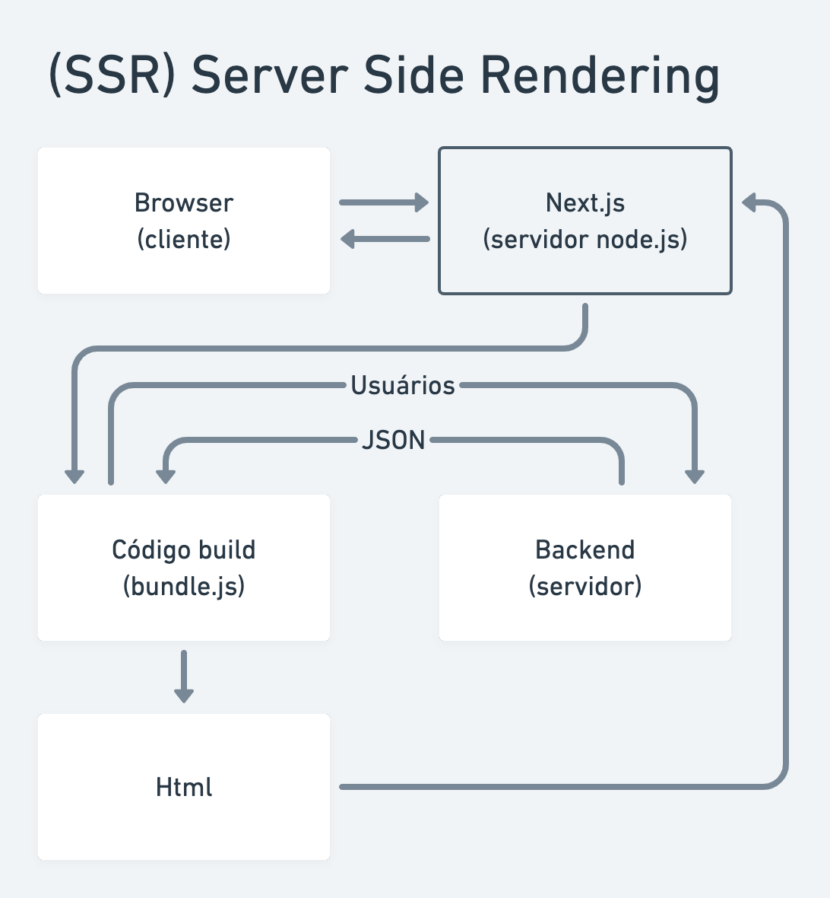

 

 

    
    
    
    
    
    
    

## Sobre
O Ignews é uma aplicação onde os usuários podem se interar de assuntos próprios do mundo React e aprimorar seus conhecimentos. Esse site foi usado como método de estudo no módulo III da trilha ReactJS do curos Ignite da Rocketseat.  
Foram usados nesse site diversos conceitos como SSR (Server-side Rendering), JAMstack, Serverless e CMS.  

### Single-page Application
O Single-page Application (SPA) é um modelo bastante usado e, de certa forma, o que é mais comum encontrarmos. O Browser __lado do cliente__ faz uma comunicação com o código React __bundle.js__ que se comunica, por sua vez, com o Back-end __servidor__ mandando dados (Nesse exemplo, mandam dados relacionados ao usuário) e retornando dados em formato JSON. Após o término dessa comunicação é renderizado o código HTML.
  
  
  
### Server-side Rendering
O Server-side Rendering (SSR) tem uma abordagem diferente. O browser __lado do cliente__ faz uma comunicação com o NextJS __um servidor NodeJS__ que se comunica com o código React __bundle.js__. O bundle manda dados para o Back-end __servidor__ e obtem um retorno em JSON. Após isso os dados são renderizados em Html, que retornam ao NextJS e após isso é retornado, ainda, ao Browser. Dessa forma todas as requisições que podem dar aquela renderização repentina na sua aplicação, são feitas no servidor Next e só após isso são realmente mandadas ao Browser, evitando-as.  
  

## Rodando a aplicação
Há alguns pontos que devem ser atentados antes de rodar o ignews.  

### .ENV
Você precisará criar um arquivo .env que terá como exemplo o arquivo .env.example. Observe que há algumas API's externas que vão precisar de chaves, então vou tentar explicar como fazer essa configuração.  

#### Stripe
Para configurar o Stripe, é necessário que crie sua conta no site [Stripe](https://www.stripe.com) e que siga os passos abaixo:
- [ ] Crie um produto com o valor 9.90 dólares em forma recorrente de pagamento
- [ ] Acesse, na sessão para desenvolvedores, as suas chaves de API
- [ ] Crie a variável `NEXT_PUBLIC_STRIPE_PUB_KEY` no seu .env e coloque como valor a sua *chave publicável*
- [ ] Crie a variável `STRIPE_API_KEY` no seu .env e coloque como valor a sua *chave secreta*  
  
O Ignews utiliza Webhooks para ouvir atualizações no stripe devido a alguma alteração automática ou influenciada por alguma ação. Para isso, acesse o site [Stripe Webhooks](https://stripe.com/docs/stripe-cli) e instale o Stripe CLI na sua máquina. Siga os passos abaixo:
- [x] Instalar o Stripe CLI
- [ ] Realizar o login através do comando `stripe login` no seu terminal
- [ ] Crie a variável `STRIPE_WEBHOOK_SECRET` no seu .env e troque pela sua *chave* que aparecerá após o comando `stripe listen --forward-to localhost:3000/api/webhooks` no seu terminal
- [ ] Replique as variáveis `STRIPE_SUC_URL` e `STRIPE_CAN_URL` no seu .env  
  
> Ao adicionar as palavras **NEXT_PUBLIC_** antes de uma variável, a torna pública. __Tome cuidado ao adicionar essas palavras__. O Stripe CLI é necessério ao desenvolver a aplicação. Para informações sobre o modo produção, acesse: [Stripe Webhooks Production](https://dashboard.stripe.com/test/webhooks).  
  
#### Github
Para configurar o Github, é necessário acessar a opção _Developer settings_ nas settings do Github e seguir os passos abaixo:
- [ ] Acesse o OAuth Apps
- [ ] Crie um novo OAuth App com o valor `http://localhost:3000/api/auth/callback` no campo _Authorization callback URL_
- [ ] Crie a variável `GITHUB_CLIENT_ID` no seu .env e coloque como valor seu *Client ID*
- [ ] Cria a variável `GITHUB_SECRET_ID` no seu .env e coloque como valor seu *Client Secrets*
- [ ] No campo _Homepage URL_ coloque como valor `http://localhost:3000`  
  
#### FaunaDB